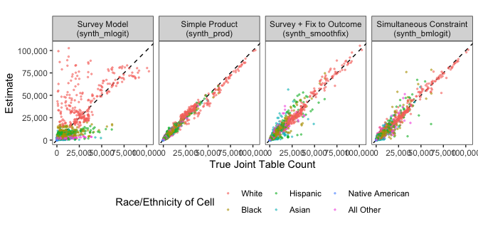
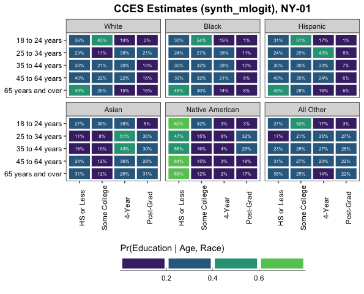
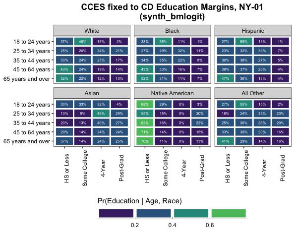

Synthetic Estimation of Joint Population Distributions
================
Shiro Kuriwaki and Soichiro Yamauchi

<!-- README.md is generated from README.Rmd. Please edit that file -->

Almost all survey weighting, whether MRP or not, face a data limitation
that direct knowledge of the joint distributions of predictors (such as
race, partisanship, and geography) are limited. There is a long
tradition of statistical and applied work that can be grouped under the
umbrella of synthetic population imputation: it seeks to expand the set
of available interactions to poststratify on. The core idea has
parallels in iterative proportional fitting (Deming and Stephan),
ecological inference, and latent factorization methods.

The package [`synthjoint`](https://github.com/kuriwaki/synthjoint)
(Kuriwaki and Yamauchi) implements key methods.

``` r
library(synthjoint)
```

We can classify the main approaches by what outside data they leverage:

| Main Idea              | Functions           | Examples                        |
|------------------------|---------------------|---------------------------------|
| Use Population Margins | `synth_prod()`      | Leemann and Wasserfallen (2017) |
| Use Microdata          | `synth_mlogit()`    | Kastellec et al. (2015)         |
| Combine both           | `synth_smoothfix()` | Ghitza and Steiz (2020)         |
|                        | `synth_bmlogit()`   | Yamauchi (2021)                 |

To setup:

``` r
library(ccesMRPprep)
library(tidyverse)
library(scales)
library(furrr)
plan(multisession, workers = 6)
```

## Validation of Multiple Methods

We provide a simple set of functions to implement this. We extend the
ACS table assisted by a survey model using a function called
`synth_mlogit()`. This uses a multinomial logit to estimate predicted
conditional probabilities. The package
[`emlogit`](https://github.com/soichiroy/emlogit) by Yamauchi provides a
fast implementation of the multinomial logit with a ECM algorithm with
Polya-Gamma Augmentation.

``` r
acs_syn_mlogit <- synth_mlogit(race ~ female + age,
                               microdata = cc18_NY,
                               poptable = acs_race_NY,  
                               area_var = "cd")
```

The `synthjoint` package provide two other approaches to estimating the
joint – these incorporate another source of information, which is the
margins that are available.

``` r
race_margins <- collapse_table(acs_race_NY, area_var = "cd", X_vars = "race", 
                               count_var = "count", new_name = "count")
race_margins
#> # A tibble: 162 × 3
#>    cd    race             count
#>    <chr> <fct>            <dbl>
#>  1 NY-01 White           427756
#>  2 NY-01 Black            31440
#>  3 NY-01 Hispanic         76067
#>  4 NY-01 Asian            25671
#>  5 NY-01 Native American      0
#>  6 NY-01 All Other        15365
#>  7 NY-02 White           366313
#>  8 NY-02 Black            52312
#>  9 NY-02 Hispanic        116653
#> 10 NY-02 Asian            17395
#> # … with 152 more rows
```

Given this data that is simply the marginal distribution of race in each
CD, one option is to simply take the product assuming independence

``` r
acs_syn_prod <- synth_prod(race ~ female + age,
                           poptable = acs_race_NY,
                           newtable = race_margins,
                           area_var = "cd")
```

A more sophisticated method is to combine these two sources of
information: microdata and known outcome margins. Ghitza and Steitz did
a two-step process, where they first did survey modeling to smooth cells
and then fixed *those* margins to the known population margins.

``` r
acs_syn_fix1 <- synth_smoothfix(race ~ female + age, 
                               microdata = cc18_NY,
                               poptable = acs_race_NY, 
                               fix_to = race_margins,
                               area_var = "cd")
```

Yamauchi [developed](https://github.com/soichiroy/bmlogit) a multinomial
logit that simultaneously imposes the same sort of balancing constraint.
The benefit of this method is that the constraint is applied
simultaneously with the estimation: the rake weighting does not nullify
the survey data, and the tolerance range can be controlled.

``` r
acs_syn_fix2 <- synth_bmlogit(race ~ female + age, 
                               microdata = cc18_NY,
                               poptable = acs_race_NY, 
                               fix_to = race_margins,
                               area_var = "cd")
```

The benefit of this example is that we can examine how our estimated
counts of this synthetic table compared with the actual values of the
joint distribution. Here is a scatter plot comparing the counts. Each
point represents a cell: \[14 congressional districts\] x \[2 gender
categories\] x \[5 age categories\] x \[6 race categories\].

<!-- -->

The first plot does not look great. The simple product does surprisingly
well. It is after all perhaps not surprising that it is hard to estimate
education from age bins and gender. The main difference seems to be that
in all the other three cases, we are fixing outcomes to *CD-level*
education margins. `synth_bmlogit()` would do worse, for example, if we
only fixed to the less granular *State-level* margins.

## Real Applications

We have a age x gender x education table and a age x gender x race
table, but not a four-way table. Here, we use the synthetic estimators
to estimate this joint table.

We know the margins of education in each congressional district in NY:

``` r
educ_target <- count(acs_educ_NY, cd, educ, wt = count, name = "count")
educ_target
#> # A tibble: 108 × 3
#>    cd    educ          count
#>    <chr> <fct>         <dbl>
#>  1 NY-01 HS or Less   202298
#>  2 NY-01 Some College 169556
#>  3 NY-01 4-Year       111561
#>  4 NY-01 Post-Grad     83255
#>  5 NY-02 HS or Less   231614
#>  6 NY-02 Some College 157090
#>  7 NY-02 4-Year        99763
#>  8 NY-02 Post-Grad     71094
#>  9 NY-03 HS or Less   138929
#> 10 NY-03 Some College 127003
#> # … with 98 more rows
```

Unfortunately, these will be collapsed statewide for now.

For bmlogit and mlogit

``` r
# No constraint
pop_svy <- synth_mlogit(educ ~ race + age + female,
                        microdata = cc18_NY,
                        poptable = acs_race_NY,
                        area_var = "cd")

# With constraint
pop_bm <- synth_bmlogit(educ ~ race + age + female,
                        microdata = cc18_NY,
                        fix_to = educ_target,
                        poptable = acs_race_NY,
                        area_var = "cd")
```

Here we show the main estimates of the model, which are conditional
probability given X strata. We fix to women and a CD, `NY-01` which is
the tip of Long Island, New York (Lee Zeldin, R; 70% White). The CD does
not matter as long as the targets are at the state level the CDs do not
matter.

<!-- -->

<!-- -->

Recall that bmlogit balances to the *area* level population targets if
available, whereas there is no balancing in the mlogit, and both always
use the entire microdata without subsetting to area. So, the values
should be somewhat different if subsetting to a different CD, like NY-14
(D, Ocasio-Cortez) where 49% of the population is Hispanic.

<!-- -->

Whereas the values would be the same regardless of district in the
mlogit implementation.
